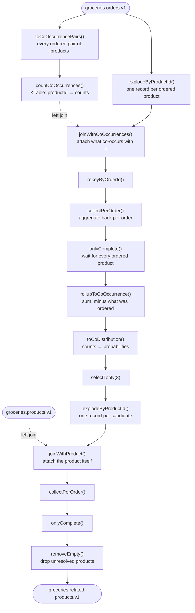

# Groceries Monorepo — Kotlin Kafka Streams

A real-time groceries recommendation engine built with Kotlin and Kafka Streams. It processes a stream of orders to
find co-occurring products and produces "related products" suggestions per order.

## Architecture

- **apps/recommender-app** — the application:
  - **Sales simulator**: generates products and a continuous stream of orders (Avro).
  - **Recommendation pipeline**: the Kafka Streams topology below.
  - **HTTP**: Ktor endpoints for health (`/health/liveness`, `/health/readiness`) and metrics (`/prometheus`).
- **libs/shared** — domain models shared across apps, the Avro `Instant` serializer and a bounded-memory RocksDB
  config setter.

### The topology

Each stream operator lives as its own extension function in
[`kafkastreams/Extensions.kt`](apps/recommender-app/src/main/kotlin/io/github/marcgoosen/groceries/recommender/kafkastreams/Extensions.kt),
so the pipeline in `TopologyBuilder.build()` reads as the diagram below and every operator is tested on its own.



The shape worth noting is the **fan-out / fan-in** that happens twice: an order is exploded into one record per
product so it can be joined against a `KTable` keyed by product, then re-keyed and aggregated back. Because a Kafka
Streams aggregation emits on *every* update, the aggregate carries the number of records it is still waiting for, and
`onlyComplete()` filters out the partial emissions. See [Design decisions](#design-decisions-and-trade-offs).

## Prerequisites

- **JDK 21** — the Gradle daemon is pinned to it via `gradle/gradle-daemon-jvm.properties`, and Gradle provisions it
  automatically if it isn't installed. A newer JDK as your default is fine.
- **Docker & Docker Compose**

## Getting started

### 1. Start the infrastructure

```bash
docker compose down -v && docker compose up -d
```

Kafka UI is at [http://localhost:9080](http://localhost:9080).

### 2. Build, check and test

```bash
./gradlew build
```

This runs ktlint (via Spotless), the unit tests, and the Kover coverage gate. It needs no Docker.

The integration test is a separate task, because it starts a real broker and Schema Registry:

```bash
./gradlew integrationTest
```

It runs the actual topology on a real Kafka with a real Schema Registry via Testcontainers, produces orders and
asserts recommendations come back. `TopologyTestDriver` uses a `mock://` registry, so it never exercises schema
registration, repartition topics or the real serde path — which is exactly where the interesting failures live.

### 3. Run the application

```bash
./gradlew :apps:recommender-app:run
```

The app creates its topics and starts producing orders by default; the `run` task only switches logging to the
human-readable local format. Watch `groceries.related-products.v1` fill up in Kafka UI.

## Topics

| Topic | Contents |
| --- | --- |
| `groceries.products.v1` | Product catalogue (compacted lookup data) |
| `groceries.orders.v1` | The order stream |
| `groceries.related-products.v1` | Recommendations, keyed by order |

## Configuration

[`application.yaml`](apps/recommender-app/src/main/resources/application.yaml) holds the defaults; everything
deployment-specific is an environment variable. The defaults are the local ones, so the app works the moment you run
it — including from an IDE. A deployment turns the simulator off with `MAIN_START_SIMULATOR=false`.

| Variable | Default | Purpose |
| --- | --- | --- |
| `KAFKA_BOOTSTRAP_SERVERS` | `localhost:19092` | Broker list |
| `KAFKA_SCHEMA_REGISTRY_URL` | `http://localhost:8081` | Schema Registry |
| `KAFKA_SCHEMA_REGISTRY_AUTH` | *(empty)* | Schema Registry basic auth, as `key:secret` |
| `KAFKA_SECURITY_PROTOCOL` | `PLAINTEXT` | Broker security protocol |
| `MAIN_CREATE_TOPICS` | `true` | Create the configured topics on startup |
| `MAIN_START_SIMULATOR` | `true` | Run the in-process order generator |
| `LOGBACK_CONFIG_FILE` | `logback.xml` | `logback-local.xml` gives human-readable logs |
| `PORT` | `8080` | HTTP port |
| `ROCKSDB_*` | see yaml | Bounds on RocksDB off-heap and memtable memory |

Credentials are masked before the resolved configuration is logged at startup.

## Design decisions and trade-offs

**Completeness is tracked in the payload, not with windows.** Both fan-in aggregations emit on every update, so a
downstream consumer would otherwise see partial recommendations. Rather than a window with an arbitrary grace period,
each aggregate carries the count it expects (`CoOccurrencesWithContext` compares against the order's product count;
`ProductsWithProbabilityContext` carries `expectedSize`) and `onlyComplete()` passes only the final emission. The
trade-off: it is exact and needs no timers, but it depends on every fan-out record arriving — a permanently lost
record leaves an aggregate that never completes.

**Local state is wiped on every start.** `streams.cleanUp()` runs before `start()`. On Kubernetes this changes
nothing, since pods start with an empty disk either way — it is there for local development, so successive runs do
not pick up the state stores the previous one left behind. On a StatefulSet with a persistent volume the line would
have to go, because it would force a full changelog restore on every restart.

**Co-occurrence state is unbounded.** `countCoOccurrences()` keeps a `KTable` of product → co-occurring product
counts that grows with the catalogue and never expires. For a fixed catalogue this is what you want; for a long-lived
deployment it needs either a windowed variant or periodic tombstoning, and the RocksDB bounds in
`BoundedMemoryRocksDBConfig` only cap memory, not disk.

**Identifiers are typealiases, not value classes.** `ProductId` and `OrderId` name the types in signatures but are
`String` at compile time, so the compiler will not catch swapping one for the other. Value classes would, but avro4k
does not handle them cleanly across the serde and Schema Registry path, and wire compatibility wins here.

**At-least-once, not exactly-once.** No `processing.guarantee` is set, so a rebalance can re-emit recommendations for
an order. The output topic is compacted and keyed by order, so a duplicate overwrites rather than accumulates.
Turning on `exactly_once_v2` is a one-line change with a real latency cost.

**Local topics are single-partition.** Both joins require co-partitioned inputs. With one partition everywhere that
is trivially true locally; a real deployment must give `orders`, `products` and the repartition topics the same
partition count.

**No dead-letter path.** A record that fails to deserialize will kill the stream thread rather than being diverted. A
`DeserializationExceptionHandler` plus a DLQ topic is the obvious next step.

## Not included yet

- Docker image and Kubernetes manifests
- The simulator extracted into its own app
- A separate Kafka initializer that owns shared topics and schemas, failing early on incompatible changes
- `KafkaStreams` state listener and uncaught-exception handler wired to the health endpoints

## License

[MIT](LICENSE)
